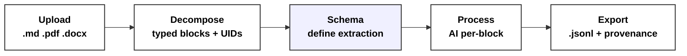
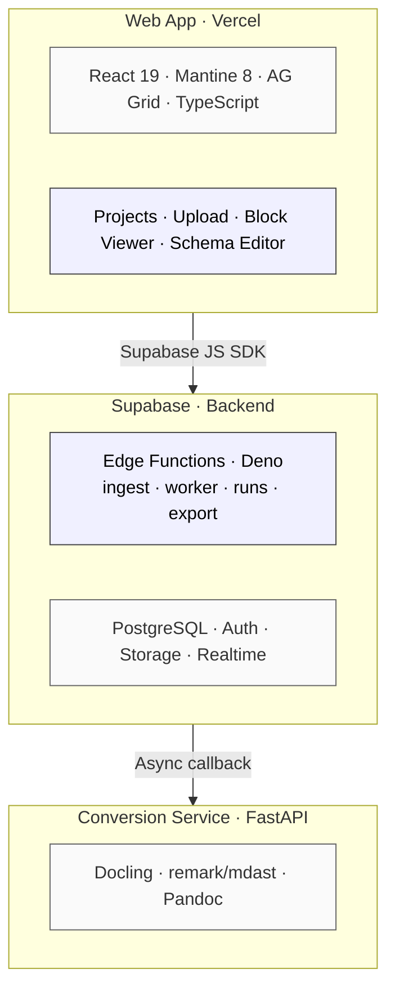

<p align="center">
  
</p>

<h3 align="center">Turn documents into structured knowledge — paragraph by paragraph, at any scale.</h3>

<p align="center">
  
  
  
  
  
  
  
</p>

---

## What It Does

BlockData meets documents where they already live — PDF, Word, Markdown, PowerPoint, HTML, plain text — converts them into an **immutable block substrate**, and lets you apply any user-defined schema to do any work across small, stable units that AI workers process in parallel.

Once processing is done, results flow anywhere: **reconstruct** back to the original format, or **construct** into downstream-ready artifacts (JSON, JSONL, CSV, Parquet, Markdown, plain text) for knowledge graph pipelines, vector search, observability/trace systems, or design workflows.

### The Problem It Solves

AI can't process long documents consistently. A 39,000-word manuscript exceeds what any single AI session handles well — the model shortcuts, loses context, skips sections. Manual extraction doesn't scale. And document-level metadata misses the value: the insight lives at the **paragraph level**.

BlockData solves this. Every block gets identical treatment. Paragraph 1 and paragraph 840 receive the same schema, the same instructions, the same quality.

## How It Works



1. **Upload** — Drop in any document: Markdown, Word, PDF, PowerPoint, HTML, plain text. Multiple files per project, any combination of formats.
2. **Decompose** — The platform splits each document into ordered, typed blocks (paragraphs, headings, tables, footnotes, figures) with stable, deterministic identities.
3. **Define a Schema** — Describe what to extract: types, enums, instructions. Browse templates, use the AI wizard, or write JSON directly in the advanced schema editor.
4. **Process** — AI processes every block independently against your schema. No context window limits. Blocks run in parallel at any scale.
5. **Export** — Structured results as JSONL with full provenance. Push to Neo4j for knowledge graphs, DuckDB for analytics, or consume via webhook.

## Use Cases

| Scenario | Scale | What You Get |
|:---------|:------|:-------------|
| **Long-document review** | 50,000-word manuscript | Paragraph-level prose editing, technical accuracy, structural assessment — each paragraph against the same standard |
| **Multi-document knowledge extraction** | 77 documents across formats | Entities, relationships, obligations, cross-references — every field traceable to its source paragraph |
| **Legal research at scale** | 28,000 opinions, 420,000 blocks | Rhetorical function, citations, legal principles at the paragraph level across entire corpora |
| **Contract review** | 45-page DOCX | Obligations, risk flags, defined terms, cross-references, and deadlines — clause by clause, with page-level tracing |

## Architecture



### Parsing Tracks

| Track | Formats | Parser | Locator Type |
|:------|:--------|:-------|:-------------|
| **mdast** | `.md` | remark (mdast AST) | `text_offset_range` |
| **Docling** | `.docx` `.pdf` `.pptx` `.xlsx` `.html` `.csv` | Docling DocumentConverter | `docling_json_pointer` |
| **Pandoc** | `.txt` `.epub` `.odt` `.rst` `.latex` | Pandoc AST | `pandoc_ast_path` |

### Data Model

```
Projects ──┐
            ├──▶ Documents ──▶ Blocks (immutable, ordered, typed, content-addressed)
            │                      │
Schemas ────┤                      │
            └──▶ Runs ─────────▶ Block Overlays (mutable AI output per block)
                                   status: pending → claimed → ai_complete → confirmed
```

- **Projects** group documents by initiative. Schemas are global and reusable across projects.
- **Documents → Blocks** — each document produces an ordered inventory of typed blocks with cryptographic identities. Re-upload the same file, get the same IDs.
- **Schemas** — user-defined JSON describing what to extract per block. Opaque to the platform — validated only for structure.
- **Runs** — apply a schema to a document's blocks. Each run generates one overlay per block.
- **Block Overlays** — structured AI output per block, tracked through `pending → claimed → ai_complete → confirmed/failed`.

### Core Invariants

1. **Immutable is never mutated after ingest** — document content is frozen; all AI output lives in a separate overlay layer
2. **User-defined schemas are overlays, not edits** — the original block content is always preserved
3. **Multi-schema is first-class** — one document supports many schemas; one schema applies across many documents
4. **The export format is the contract** — the database is storage; canonical output is assembled on demand

### Blocks Are the Universal Interchange Unit

Everything before blocks is **ingestion**. Everything after is **routing**. The middle is schema-driven AI work on small, stable, parallelizable units.

```
blocks_v2 + block_overlays_v2 (source of truth)
  ├→ vector index (assistant retrieval) — reads DB directly
  ├→ knowledge graph pipeline
  ├→ observability / trace pipeline
  ├→ export as JSON / JSONL  ─┐
  ├→ export as Markdown        ├→ user downloads
  ├→ export as CSV / Parquet  ─┘
  └→ reconstruct to original format
```

Downstream consumers are independent. Add a new one by writing a new adapter that reads from blocks + overlays. The core doesn't change.

### Key Properties

- **Deterministic identity** — `source_uid = sha256(type + bytes)`, `conv_uid = sha256(tool + rep_type + rep_bytes)`, `block_uid = conv_uid:block_index`
- **Parallel processing** — block overlays act as a distributed work queue; multiple AI workers claim and process blocks concurrently
- **Staging → Confirmed** — AI writes to staging; humans review and confirm; only confirmed overlays export by default
- **Prompt caching** — 50% cost reduction on input tokens via Anthropic ephemeral cache
- **Realtime viewer** — AG Grid with Supabase Realtime subscriptions; blocks update live as workers process

## Tech Stack

| Layer | Technology |
|:------|:-----------|
| **Frontend** | React 19, Mantine 8, AG Grid 35, Tabler Icons, Monaco Editor |
| **Build** | Vite 7, TypeScript 5.9, ESLint |
| **Backend** | Supabase Edge Functions (Deno), PostgreSQL with RLS |
| **Auth** | Supabase Auth (email/password, OAuth) |
| **AI Providers** | Anthropic (Claude), OpenAI (GPT-4), Google (Gemini), custom endpoints |
| **Document Parsing** | Docling (PDF/DOCX/PPTX), remark/mdast (Markdown), Pandoc (EPUB/ODT/RST) |
| **Conversion** | FastAPI + Docling (Python) |
| **Schema Editor** | MetaConfigurator (Vue 3 island embed) |
| **Hosting** | Vercel (frontend), Supabase Cloud (backend) |

## Canonical Export Format

Every exported block is a single JSON object with exactly two top-level keys:

```jsonc
{
  "immutable": {
    "source_upload": {
      "source_uid": "a1b2c3...",           // sha256(source_type + raw_bytes)
      "source_type": "pdf",
      "source_filesize": 2048000
    },
    "conversion": {
      "conv_uid": "d4e5f6...",             // sha256(tool + rep_type + rep_bytes)
      "conv_parsing_tool": "docling",
      "conv_total_blocks": 842,
      "conv_block_type_freq": { "paragraph": 751, "heading": 78, "table": 13 }
    },
    "block": {
      "block_uid": "d4e5f6...:5",          // conv_uid + ":" + block_index
      "block_index": 5,
      "block_type": "paragraph",
      "block_locator": { "type": "docling_json_pointer", "pointer": "#/texts/5", "page_no": 2 },
      "block_content": "The actual paragraph text."
    }
  },
  "user_defined": {
    "data": {
      "revised_content": "Improved paragraph text.",
      "simplification_notes": "Removed passive voice."
    }
  }
}
```

## Local Development

### Prerequisites

- Node.js 20+
- Python 3.12+ (for conversion service)
- Docker (for local Supabase)
- Supabase CLI (`npm i -g supabase`)

### 1. Clone

```bash
git clone https://github.com/prophetto1/blockdata.git
cd blockdata
```

### 2. Environment

```bash
cp .env.example .env
```

Fill in the values:

| Variable | Description | Required |
|:---------|:------------|:--------:|
| `SUPABASE_URL` | Supabase project URL | Yes |
| `SUPABASE_ANON_KEY` | Supabase anonymous/public key | Yes |
| `SUPABASE_SERVICE_ROLE_KEY` | Server-only secret for admin operations | Yes |
| `ANTHROPIC_API_KEY` | Claude API key (for AI processing) | Yes |
| `OPENAI_API_KEY` | OpenAI API key (optional provider) | No |
| `DATABASE_URL` | Direct PostgreSQL connection string | No |
| `WORKER_PROMPT_CACHING_ENABLED` | Enable Anthropic prompt caching (default: `true`) | No |

### 3. Frontend

```bash
cd web
npm install
npm run dev                # http://localhost:5173
```

### 4. Supabase (Local)

```bash
supabase start             # Starts local PostgreSQL, Auth, Storage, Realtime
supabase db push           # Apply all migrations
supabase functions serve   # Serve edge functions locally
```

### 5. Conversion Service

```bash
cd services/conversion-service
pip install -r requirements.txt
CONVERSION_SERVICE_KEY=your-secret uvicorn app.main:app --port 8000
```

### 6. Docs Site (Optional)

```bash
cd docs-site
npm install
npm run dev                # Astro Starlight docs at http://localhost:4321
```

## Project Structure

```
blockdata/
├── web/                          # React frontend (Vercel)
│   ├── src/
│   │   ├── pages/                # Route components
│   │   │   ├── Landing.tsx       # Marketing hero
│   │   │   ├── WorkspaceHome.tsx # Dashboard
│   │   │   ├── ProjectDetail.tsx # Project view + documents
│   │   │   ├── DocumentDetail.tsx# Block viewer + runs + export
│   │   │   ├── Upload.tsx        # Drag-drop multi-file upload
│   │   │   ├── Schemas.tsx       # Schema management
│   │   │   ├── SchemaAdvancedEditor.tsx # Visual schema builder
│   │   │   ├── RunDetail.tsx     # Run progress + metrics
│   │   │   └── Settings.tsx      # API keys + model defaults
│   │   ├── components/
│   │   │   ├── BlockViewerGrid.tsx  # AG Grid block table (Realtime)
│   │   │   ├── AppLayout.tsx     # Authenticated app shell
│   │   │   ├── LeftRail.tsx      # Sidebar navigation
│   │   │   └── RunSelector.tsx   # Schema run switcher
│   │   ├── hooks/                # useBlocks, useRuns, useOverlays
│   │   ├── auth/                 # AuthContext, AuthGuard
│   │   ├── lib/                  # Supabase client, types, utilities
│   │   └── router.tsx            # React Router config
│   └── vercel.json               # Deployment config (SPA fallback)
│
├── supabase/
│   ├── functions/
│   │   ├── ingest/               # Upload → parse → extract blocks
│   │   ├── worker/               # Claim blocks → LLM → write overlay
│   │   ├── runs/                 # Create schema×document run
│   │   ├── export-jsonl/         # Assemble canonical JSONL
│   │   ├── schemas/              # Schema CRUD
│   │   ├── user-api-keys/        # Encrypted key storage
│   │   ├── conversion-complete/  # Async conversion callback
│   │   └── _shared/              # CORS, auth, crypto utilities
│   └── migrations/               # PostgreSQL schema (17 migrations)
│
├── services/
│   └── conversion-service/       # FastAPI + Docling (PDF/DOCX → Markdown)
│
├── docs/
│   ├── product-defining-v2.0/    # Canonical spec (immutable fields, blocks, PRD)
│   └── ongoing-tasks/            # Priority queue + optimization tracking
│
├── docs-site/                    # Astro Starlight documentation site
│
└── scripts/                      # Benchmarks + build tooling
```

## Database Schema

All tables are protected by Row-Level Security (RLS). Users can only access their own data.

| Table | Purpose | Key Columns |
|:------|:--------|:------------|
| `projects` | Group documents by initiative | `project_id`, `owner_id`, `project_name` |
| `documents_v2` | Document metadata (content-addressed) | `conv_uid` (PK), `source_uid`, `source_type`, `status`, `conv_parsing_tool` |
| `blocks_v2` | Immutable block inventory | `block_uid` (PK), `conv_uid`, `block_index`, `block_type`, `block_content` |
| `schemas` | User-defined extraction schemas | `schema_id`, `schema_ref`, `schema_uid`, `schema_jsonb` |
| `runs_v2` | Schema execution instances | `run_id`, `conv_uid`, `schema_id`, `status`, `model_config` |
| `block_overlays_v2` | Mutable AI output per block | `run_id`, `block_uid`, `overlay_jsonb_staging`, `status` |
| `user_api_keys` | Encrypted provider API keys | `provider`, `api_key_encrypted`, `default_model` |
| `profiles` | User metadata | `user_id`, `email`, `display_name` |

## AI Provider Support

BlockData supports multiple AI providers. Users configure their own API keys in Settings.

| Provider | Models | Features |
|:---------|:-------|:---------|
| **Anthropic** | Claude Opus 4.6, Sonnet 4.5, Haiku 4.5 | Prompt caching (50% input cost reduction) |
| **OpenAI** | GPT-4.1, GPT-4.1 Mini, GPT-4o | Standard completion |
| **Google** | Gemini models | Standard completion |
| **Custom** | Any OpenAI-compatible endpoint | Custom `base_url` support |

## Deployment

### Frontend → Vercel

The web app deploys as a Vite SPA to Vercel. The docs site (Astro Starlight) is built and nested at `/docs/`.

```bash
cd web
npm run build              # Builds web + docs-site into dist/
```

### Backend → Supabase Cloud

Edge functions deploy to Supabase's Deno runtime. Database migrations are applied via the Supabase CLI.

```bash
supabase db push           # Apply migrations to remote
supabase functions deploy --no-verify-jwt   # Deploy all edge functions (avoid gateway JWT drift)
```

### Conversion Service → Any Container Host

The FastAPI service runs anywhere that supports Docker or Python.

```bash
cd services/conversion-service
docker build -t blockdata-conversion .
docker run -p 8000:8000 -e CONVERSION_SERVICE_KEY=secret blockdata-conversion
```

## License

Proprietary. All rights reserved.
