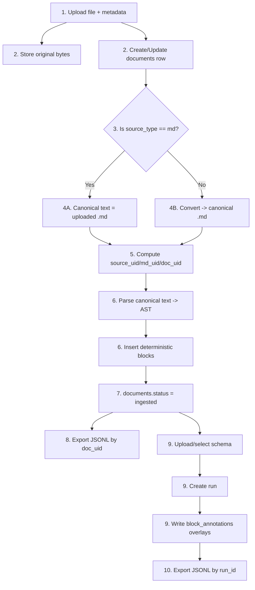

# Workflow Page Spec: Upload → Deterministic Blocks → Export (JSONL)

Status date: 2026-02-03  
Purpose: a technical, diagram-first workflow page. Not marketing. No “security features” section.

---

## 1) Page goal (one sentence)

Show the exact end-to-end pipeline a user runs: **upload any document → deterministic block inventory → export JSONL**, with the minimum technical detail required to understand what happens and where to look when something fails.

---

## 2) Inputs / Outputs (at-a-glance)

### Inputs

- A file (`.md`, `.docx`, `.pdf`, `.txt`)
- `doc_title` (string; user-provided or derived)
- `immutable_schema_ref` (classification label; selected at upload)

### Outputs (Phase 1)

- A `documents` row representing lifecycle + pointers to stored artifacts
- A deterministic set of `blocks` rows in reading order
- Exportable JSONL (one line per block) with the canonical “immutable + annotation” shape

### Outputs (Phase 2, overlay)

- Uploaded `schemas` (user-defined)
- `annotation_runs` (run-level progress)
- `block_annotations` (per-block overlays keyed by `(run_id, block_uid)`)
- Exportable JSONL parameterized by `run_id`

---

## 3) Workflow: numbered steps (the page’s primary content)

This section renders as a **vertical stepper** with an accompanying **schematic** (next section).

### Step 1 — Upload

- User selects a file and submits ingest metadata (`immutable_schema_ref`, `doc_title`).
- The system stores the original bytes and creates/updates the document lifecycle row.

**UI surface:** `/app/upload`  
**API:** `POST /functions/v1/ingest` (multipart: `file`, `immutable_schema_ref`, `doc_title`)

### Step 2 — Persist original bytes + lifecycle row

- Original bytes are stored in Storage under a content-addressed location.
- A `documents` row exists for the upload and becomes the authoritative place to read pipeline status.

**Artifacts:**
- Original bytes: `uploads/{source_uid}/{original_filename}`

**DB:** `documents`

### Step 3 — Decide conversion path (only branch)

If the source is already Markdown (`source_type == "md"`):
- Skip conversion. The upload itself is treated as the canonical text artifact.

If the source is not Markdown:
- Request conversion to produce the canonical text artifact used for block extraction.

**Observed state:** `documents.status` becomes `uploaded` or `converting` (depending on path + implementation details).

### Step 4A — Canonical text artifact (MD path)

- The canonical text artifact is the uploaded `.md`.

**Artifacts:**
- Canonical text: `md_locator == source_locator`

### Step 4B — Canonical text artifact (non-MD path)

- A conversion job produces a canonical `.md` and stores it in Storage.
- The conversion-complete callback allows ingest to proceed with block extraction.

**Artifacts:**
- Canonical text: `converted/{source_uid}/{basename}.md`

### Step 5 — Compute deterministic identities

Compute content-addressed hashes used across the pipeline:

- `source_uid` identifies the original bytes
- `md_uid` identifies the canonical text bytes
- `doc_uid` identifies “this canonical text under this immutable schema label”
- `block_uid` identifies each block deterministically by index

### Step 6 — Extract deterministic blocks

- Parse canonical text → AST.
- Emit blocks in stable reading order.
- Persist blocks with navigation metadata (type, section path, offsets).

**DB:** `blocks` (immutable inventory)

### Step 7 — Mark ingest complete (or failed)

- On success: `documents.status = ingested`
- On failure: `documents.status = ingest_failed` (or `conversion_failed` if conversion never completes)

**DB:** `documents.status`, `documents.error`

### Step 8 — Export JSONL (Phase 1)

- Export returns one JSON object per block with:
  - `immutable` populated from `documents + blocks`
  - `annotation` present but inert (`schema_ref=null`, `data={}`)

**API:** `GET /functions/v1/export-jsonl?doc_uid=...`

### Step 9 — Apply a user-defined schema (Phase 2 overlay)

- Upload or select a schema (a “lens”) describing fields the system should fill for each block.
- Create a run binding a document to a schema.
- Write overlays to `block_annotations` keyed by `(run_id, block_uid)`.

**UI surfaces:** `/app/schemas`, `/app/runs`  
**APIs:** `POST /functions/v1/schemas`, `POST /functions/v1/runs`

### Step 10 — Export JSONL (Phase 2 overlay)

- Export parameterized by `run_id` merges:
  - immutable block inventory (same as Phase 1)
  - annotation overlay from `block_annotations` for that run

**API:** `GET /functions/v1/export-jsonl?run_id=...`

---

## 4) Workflow schematic (single diagram, diagram-first)

Render this diagram directly on the page (SVG preferred). It’s the same story as the stepper, but spatial.

---

## 5) Definitions (only what’s needed to read the diagram)

- `documents`: per-upload lifecycle row (status, error, locators, IDs)
- `blocks`: immutable block inventory (one row per extracted unit, ordered)
- `schemas`: user-defined annotation schema definitions (Phase 2)
- `annotation_runs`: per-doc+schema run record with progress (Phase 2)
- `block_annotations`: per-run overlay keyed by `(run_id, block_uid)` (Phase 2)

Key IDs:
- `source_uid`: content-addressed ID of original bytes
- `md_uid`: content-addressed ID of canonical text bytes
- `doc_uid`: content-addressed ID of canonical text + immutable schema label
- `block_uid`: content-addressed ID of `(doc_uid, block_index)`

---

## 6) “Where do I see this in the app?” (small, optional footer)

- Upload + start ingest: `/app/upload`
- Lifecycle + IDs: `/app/documents/[source_uid]`
- Block inventory: `/app/documents/[source_uid]/blocks`
- Export (Phase 1): document page “Export JSONL”
- Schema upload/list (Phase 2): `/app/schemas`
- Create/list runs (Phase 2): `/app/runs`
- Export (Phase 2): `/app/runs/[run_id]` → Export JSONL

