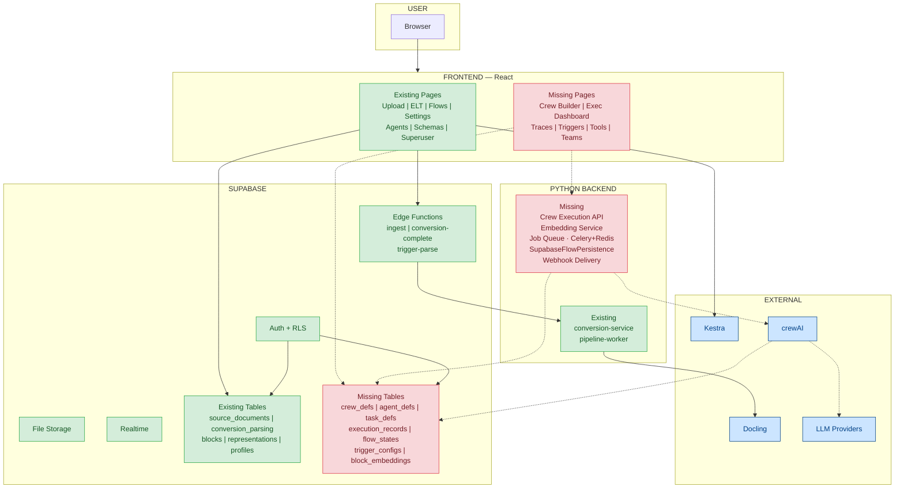
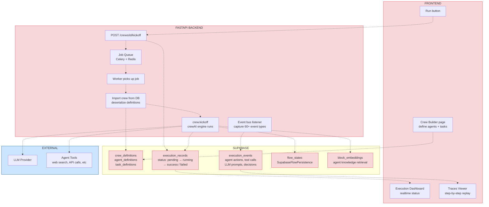
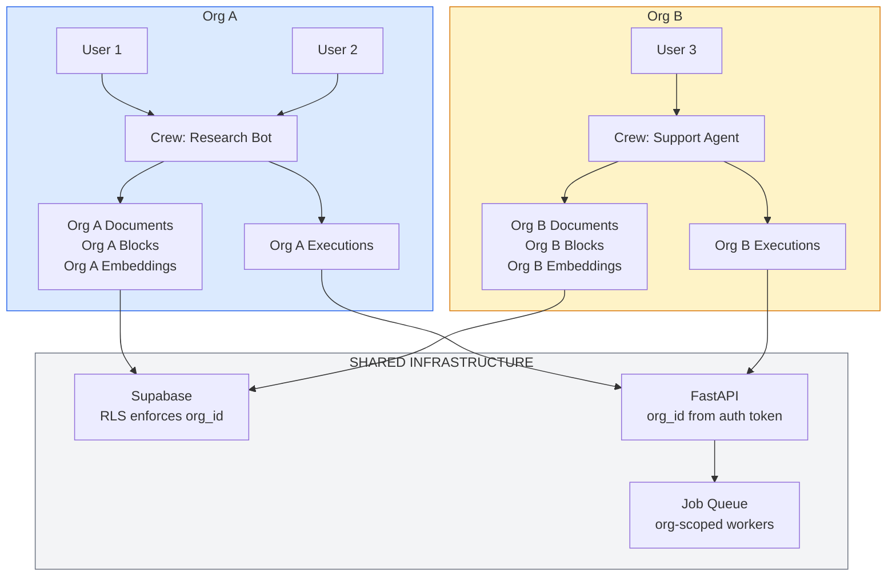
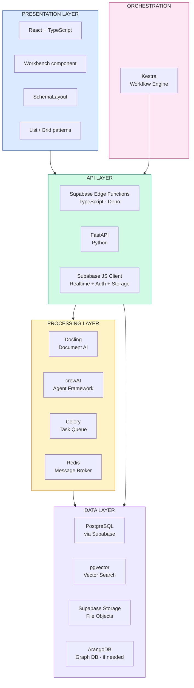

# BD2 Full System Architecture

> Open this file in VS Code with a Mermaid preview extension to see the diagrams rendered.

---

## 1. The Full Picture — What Exists vs What's Missing

---

## 2. Document Pipeline — End to End (Upload → Agent Knowledge)

This is the core data flow. Green = built. Red = needs building.

```mermaid
flowchart LR
    subgraph UPLOAD["1 · UPLOAD"]
        A1["User drops file"]
        A2["ingest edge fn"]
        A3["Supabase Storage"]
        A4["source_documents row"]
    end

    subgraph PARSE["2 · PARSE"]
        B1["conversion-service\nPython"]
        B2["Docling\nPDF/DOCX/PPTX"]
        B3["Pandoc\nRST/LaTeX/EPUB"]
        B4["Mdast\nMarkdown"]
    end

    subgraph EXTRACT["3 · EXTRACT"]
        C1["conversion-complete\nedge fn"]
        C2["blocks table\nheading | paragraph\ntable | code | figure"]
        C3["conversion_parsing\nmetadata + stats"]
        C4["representations\nHTML | DocTags | MD"]
    end

    subgraph EMBED["4 · EMBED"]
        D1["Embedding Service\nFastAPI endpoint"]
        D2["Embedding Provider\nOpenAI / Cohere / local"]
        D3["block_embeddings\npgvector column"]
    end

    subgraph RETRIEVE["5 · RETRIEVE"]
        E1["BlockDataKnowledgeSource\ncrewAI-compatible"]
        E2["cosine similarity\nSQL query"]
        E3["Agent gets\nrelevant chunks"]
    end

    subgraph EXECUTE["6 · EXECUTE"]
        F1["crewAI Crew\nAgent + Task"]
        F2["LLM call\nwith knowledge context"]
        F3["execution_records\nresult stored"]
    end

    A1 --> A2 --> A3
    A2 --> A4
    A2 --> B1
    B1 --> B2 & B3 & B4
    B2 & B3 & B4 --> C1
    C1 --> C2 & C3 & C4

    C2 -.-> D1
    D1 -.-> D2
    D2 -.-> D3

    D3 -.-> E1
    E1 -.-> E2
    E2 -.-> E3

    E3 -.-> F1
    F1 -.-> F2
    F2 -.-> F3

    style UPLOAD fill:#d4edda,stroke:#28a745
    style PARSE fill:#d4edda,stroke:#28a745
    style EXTRACT fill:#d4edda,stroke:#28a745
    style EMBED fill:#f8d7da,stroke:#dc3545
    style RETRIEVE fill:#f8d7da,stroke:#dc3545
    style EXECUTE fill:#f8d7da,stroke:#dc3545
```

---

## 3. Crew Execution Pipeline — The Agent Side

---

## 4. Multi-User Data Isolation

---

## 5. Technology Stack Map

---

## Legend

| Color | Meaning |
|-------|---------|
| Green (`#d4edda`) | Built and working |
| Red (`#f8d7da`) | Needs to be built |
| Blue (`#cce5ff`) | External service (exists, needs integration) |
| Gray (`#f3f4f6`) | Shared infrastructure |
