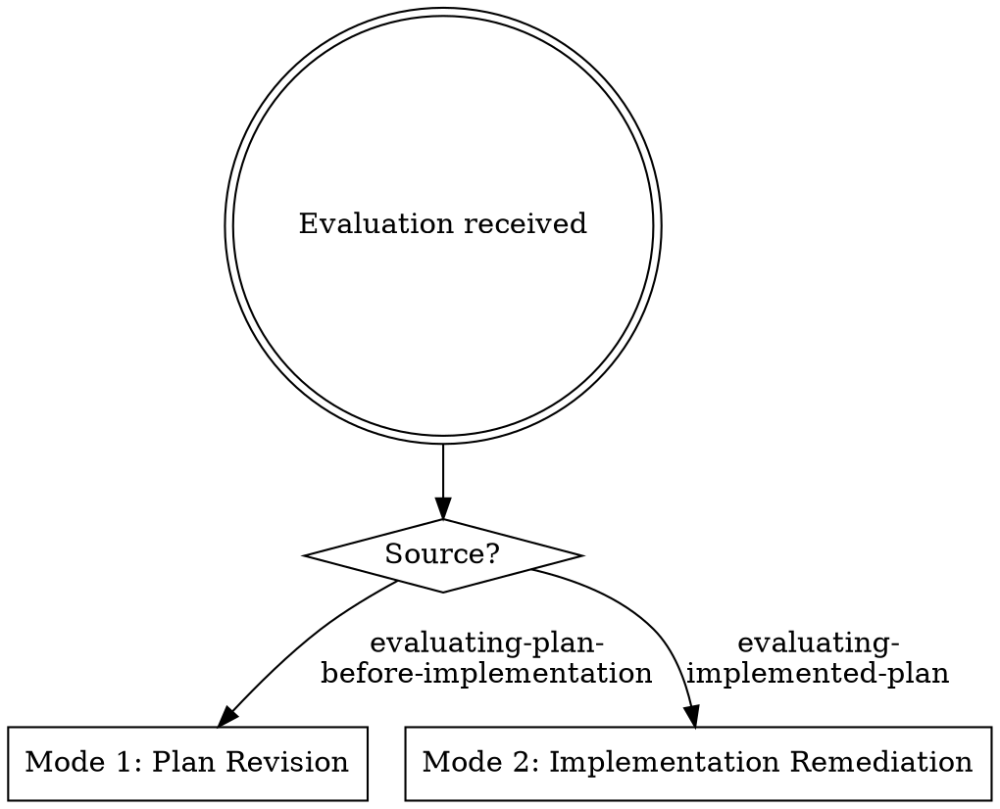

# Addressing Evaluation Findings

## Overview

Evaluation from a 3rd-party assessor may be right, partially right, or wrong. Cross-check first, then act on what's verified.

**Core principle:** Verify every finding against reality before acting. Never blindly accept. Never blindly reject. Then make targeted edits — not rewrites.

**Announce:** "Using addressing-evaluation-findings to cross-check this evaluation and address verified findings."

## When to Use



Select your mode before proceeding:

- **Mode 1 (Plan Revision):** Evaluation came from `evaluating-plan-before-implementation`. You are editing a plan document.
- **Mode 2 (Implementation Remediation):** Evaluation came from `evaluating-implemented-plan`. You are fixing code.

---

## The Disposition Contract

Every finding classified as verified-accurate or partially-accurate must reach one of exactly three dispositions:

| Disposition | When valid | Constraint |
|-------------|-----------|------------|
| **Fixed** | You made the specific change | State what changed |
| **Disagreed** | Verified inaccurate, or partially accurate with the accurate part addressed | Evidence from cross-check required |
| **Deferred** | Valid but genuinely out of scope for this revision | **Requires explicit human partner approval. You cannot self-approve a deferral.** |

There is no fourth disposition. A verified defect cannot be "accepted," "noted for the record," or "acknowledged" into compliance. If a finding identifies a real defect and you do not fix it, the only path is Deferred — and your human partner must approve it.

Observations that are not defects (e.g., "this asymmetry exists by design") go in the tracker as Disagreed with evidence of the design intent.

### Scope Discipline

- Never extend revision beyond verified findings. No refactoring, no "while I'm here" improvements.
- The only exception: mechanical cascade (changed endpoint shape requires inventory count update).
- If you discover something else that needs modification, present it to your human partner first. No exceptions.

### Targeted Updates, Not Rewrites

You are producing a v2.1, not scrapping v2. Unless the evaluation explicitly recommended "Rethink," the fundamental approach stays.

---

## Phase 1: Investigate the Evaluation

Cross-checking IS investigation. By the time you verify each finding against the live codebase, you already understand what's true, what's not, and what each verified finding requires.

1. **Read the evaluation output in full.** Structural verdict, every finding, every piece of evidence.

2. **Investigate each finding against reality.** Read the actual files, verify line numbers, check whether the claim matches the live state. For findings you verify as accurate, trace what fixing it would touch — do this now, not later.

3. **Classify and scope each finding:**

   | Classification | Meaning |
   |---------------|---------|
   | **Verified accurate** | Confirmed. Note what the fix touches. |
   | **Verified inaccurate** | Evaluator was wrong. Document evidence. |
   | **Partially accurate** | Real issue, wrong characterization. Note what's actually true. |
   | **Cannot verify** | Insufficient information. Flag for discussion. |

4. **Build the verified findings tracker:**

   ```
   | # | Severity | Finding | Verification | Scope of Fix | Disposition |
   |---|----------|---------|--------------|--------------|-------------|
   ```

5. **Present the investigation to your human partner** before Phase 2. Your partner sees what you verified, what you disagree with, and the scope of each fix before any changes are made.

---

## Phase 2: Act on Verified Findings

Investigation is done. You know what's true and what each fix requires. Now act.

### Mode 1: Plan Revision (lightweight `investigating-and-writing-plan`)

You are revising a plan document with the same writing discipline as `investigating-and-writing-plan`, scoped to verified findings only.

For each verified finding, by severity (Critical first):

1. **Make the minimal edit.** The scope was determined in Phase 1.
2. **Trace cascades as you go.** Changed endpoint → update referencing tasks. Changed inventory item → update counts. Mechanical, not creative.

After all findings addressed:

3. **Cross-reference check:** counts match items, tasks cover manifest, contracts are consistent, paths are correct.
4. **Re-lock any affected contracts.**

### Mode 2: Implementation Remediation (lightweight `executing-approved-plans`)

You are fixing code to match the approved plan, with the same contract-tracking discipline as `executing-approved-plans`, scoped to verified findings only.

For each verified finding, by severity (Critical first):

1. **Fix as the plan specifies.** The plan defines "correct," not your intuition. The scope was determined in Phase 1.
2. **Verify independently after each fix.** Do not batch — each critical deviation gets its own verification cycle.

After all findings addressed:

3. **Run the pre-completion self-audit** from `executing-approved-plans`: manifest check, inventory count, locked decisions, completion criteria.

---

## Phase 3: Revision Summary and Re-Evaluation

Present to your human partner:

```markdown
## Revision Summary

**Evaluation cross-checked:** [source]
**Artifact revised:** [plan path or branch]

### Cross-Check Results
- Verified accurate: N
- Verified inaccurate: N (with evidence)
- Partially accurate: N

### Findings Fixed
- [finding] → [what changed]

### Findings Disagreed
- [finding] → [evidence]

### Findings Deferred (human-approved)
- [finding] → [justification + approval reference]

### Cascading Changes
- [mechanical consistency fixes]

### Ready for re-evaluation.
```

The loop closes when the evaluator says "Approve" or "Compliant," not when you think you're done.

---

## When to Stop and Ask

- A verified finding would require changing a locked decision the evaluator didn't flag
- Findings contradict each other
- A Critical finding appears inaccurate but you cannot conclusively prove it
- Addressing a finding introduces scope beyond the evaluation
- 2+ failed attempts at the same finding

**Stop means stop.** Present the issue and wait.

## Red Flags

| Thought | Reality |
|---------|---------|
| "The evaluator said it's wrong, so it must be" | Did you verify? Cross-check first. |
| "While I'm here, I should also clean up Z" | Out of scope. |
| "This is only Minor, I'll skip it" | Every finding gets an explicit disposition. |
| "I'll fix this differently than the plan says" | The plan is the source of truth. |
| "I addressed the spirit of the finding" | Did you make the specific change? |
| "I'll just accept all findings" | Blindly accepting = blindly rejecting. Verify. |
| "I'll defer this — not important enough" | Did your human partner approve? Self-approved deferrals are invalid. |
| "I'll note it for the record" | "Noted" is not a disposition. Fix it, disagree with evidence, or get deferral approved. |
