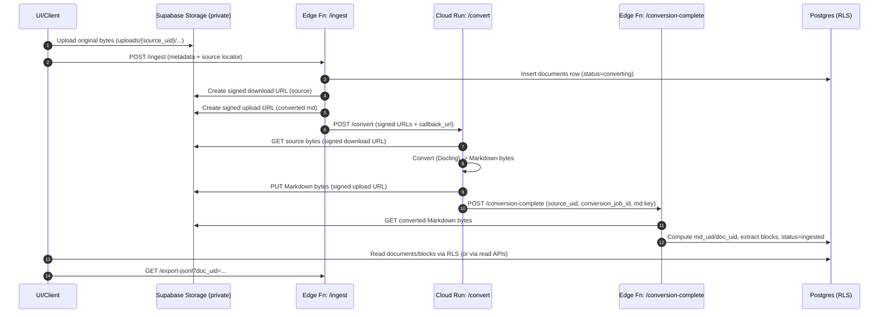

# Core Pipeline Diagram (Phase 1)

Status date: 2026-02-03  
Scope: upload -> (convert if needed) -> canonical Markdown -> deterministic blocks in Postgres -> JSONL export.

This diagram is a visual companion to `docs/specs/canonical-pipeline-contract.md`.

## One pipeline, two entry paths

There is one canonical pipeline. The only conditional branch is whether we must generate the canonical Markdown artifact from the uploaded bytes:

- If the upload is already `.md`, it becomes the canonical Markdown directly.
- If the upload is non-Markdown (e.g. `.docx`, `.pdf`, `.txt`), we first convert it to Markdown via the conversion service (Docling for `docx|pdf`, direct decode for `txt`).

After canonical Markdown exists, the downstream flow (hashes, parsing, block extraction, export) is the same regardless of the original file type.

## Flowchart

```mermaid
flowchart TD
  A[User uploads file] --> B[Supabase Storage<br/>documents/uploads/{source_uid}/...]
  A --> C[UI or API calls<br/>POST /functions/v1/ingest]

  C --> D[Edge Function: ingest<br/>Create documents row<br/>status=received|converting]

  D --> E{Is source_type == "md"?}

  %% MD path
  E -- Yes --> F[Canonical Markdown is source bytes<br/>md_locator = source_locator]
  F --> G[Compute md_uid, doc_uid]
  G --> H[Parse Markdown -> mdast<br/>(remark-parse + remark-gfm)]
  H --> I[Write blocks rows<br/>char_span offsets into md bytes]
  I --> J[documents.status = ingested]

  %% Non-MD path
  E -- No --> K[Generate signed URLs<br/>download (source)<br/>upload (converted md)]
  K --> L[Call conversion service<br/>POST {CLOUD_RUN_URL}/convert]
  L --> M[Conversion service downloads bytes<br/>from signed URL]
  M --> N[Convert to Markdown<br/>Docling (docx|pdf) / decode (txt)]
  N --> O[Upload Markdown bytes<br/>to signed upload URL]
  O --> P[Callback<br/>POST /functions/v1/conversion-complete]
  P --> Q[Edge Function: conversion-complete<br/>read md from Storage<br/>compute md_uid/doc_uid]
  Q --> H

  %% Export
  J --> R[GET /functions/v1/export-jsonl?doc_uid=...]
  R --> S[JSONL emitted (Phase 1 shape)]
```

## Non-Markdown sequence (Docling)



## Is the pipeline doc-type agnostic?

Mostly yes (by design):

- The canonical intermediate is always Markdown, and block extraction always runs on Markdown -> mdast.
- `char_span` is defined as offsets into the canonical Markdown bytes at `documents.md_locator`, regardless of the original file type.
- The original source bytes are always preserved in Storage for audit/debug (`documents.source_locator`).

Where doc type *can* change behavior:

- Conversion step only: adding a new file type (e.g. `html`, `rtf`, `pptx`) requires implementing and validating a new conversion method that produces acceptable Markdown.
- Resource/time characteristics: PDFs may require higher memory/timeouts; some formats may need extra system dependencies in the conversion container.
- Optional structured artifacts: Docling JSON export is currently treated as debug/QA; promoting it to a required artifact would be a deliberate pipeline change.

