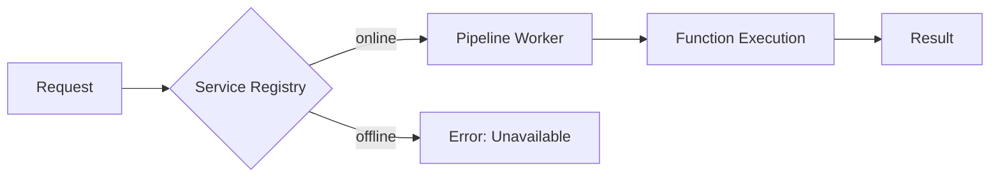
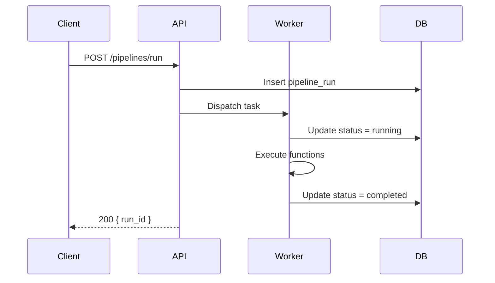

{/* =========================================================
    SECTION 1 — BASIC TEXT FORMATTING
    ========================================================= */}

## 1. Basic Text

Paragraph with **bold**, _italic_, **_bold + italic_**, `inline code`, and ~~strikethrough~~.

Combined: **bold and _nested italic_** and _italic **with bold**_.

> Single-line blockquote.

> Multi-paragraph blockquote.
>
> Second paragraph inside the same blockquote.

---

{/* =========================================================
    SECTION 2 — EXTENDED TEXT: SUPER / SUB / HIGHLIGHT
    ========================================================= */}

## 2. Super / Subscript / Highlight

### Superscript

`^` extended syntax (probably not supported): x^2^ and E=mc^2^

HTML `<sup>` (MDX-safe): x<sup>2</sup> and E=mc<sup>2</sup>

### Subscript

`~` extended syntax (probably not supported): H~2~O and CO~2~

HTML `<sub>` (MDX-safe): H<sub>2</sub>O and CO<sub>2</sub>

### Highlight

`==text==` extended syntax (probably not supported): ==highlighted text==

HTML `<mark>` (probably unstyled): <mark>highlighted with mark tag</mark>

---

{/* =========================================================
    SECTION 3 — STRIKETHROUGH (GFM — SUPPORTED)
    ========================================================= */}

## 3. Strikethrough

Double tilde (GFM, confirmed supported): ~~deprecated field~~ ~~removed endpoint~~

---

{/* =========================================================
    SECTION 4 — TABLES (GFM — SUPPORTED)
    ========================================================= */}

## 4. Tables

### Default alignment

| Column A | Column B | Column C |
| -------- | -------- | -------- |
| value 1  | value 2  | value 3  |
| value 4  | value 5  | value 6  |

### With alignment specifiers

| Left-aligned | Centered | Right-aligned |
| :----------- | :------: | ------------: |
| text         |  text    |          text |
| longer text  |  short   |      12345.67 |
| `code`       | **bold** |    _italic_   |

### Formatting inside cells

| Type | Example | Notes |
| ---- | ------- | ----- |
| Code | `SELECT *` | inline code in cell |
| Bold | **important** | bold in cell |
| Link | [Docs](https://mintlify.com) | link in cell |
| Strikethrough | ~~old~~ → new | strikethrough in cell |

---

{/* =========================================================
    SECTION 5 — LISTS
    ========================================================= */}

## 5. Lists

### Ordered

1. First item
2. Second item
3. Third item
   1. Nested ordered
   2. Also nested

### Unordered

- Item one
- Item two
  - Nested item
  - Another nested
    - Deeply nested

### Task List (GFM — probably not supported in Mintlify)

- [x] Completed task
- [ ] Pending task
- [ ] Task with `code` in it
- [x] Task with **bold** label

---

{/* =========================================================
    SECTION 6 — LINKS & AUTOLINKS
    ========================================================= */}

## 6. Links

- Standard: [Markdown Guide](https://www.markdownguide.org/)
- Autolink: https://www.markdownguide.org/extended-syntax/
- Email: [contact@example.com](mailto:contact@example.com)
- Internal page: [API Overview](/api-reference/overview)
- Anchor: [Jump to Code Blocks](#7-code-blocks)

---

{/* =========================================================
    SECTION 7 — CODE BLOCKS (SUPPORTED + MINTLIFY EXTENSIONS)
    ========================================================= */}

## 7. Code Blocks

### Language only

```typescript
type ServiceRow = {
  service_id: string;
  service_name: string;
  health_status: 'online' | 'degraded' | 'offline';
  enabled: boolean;
};
```

### Language + title label

```python run_pipeline.py
def run_pipeline(pipeline_id: str) -> dict:
    result = client.post(f"/pipelines/{pipeline_id}/run")
    return result.json()
```

### Line highlighting `{lines}`

```typescript {3,5-7}
export function ServicesPanel({ mode = 'admin' }) {
  const isAdmin = mode === 'admin';
  const [services, setServices] = useState([]);       // highlighted
  const [loading, setLoading] = useState(false);
  const [selectedId, setSelectedId] = useState(null); // highlighted
  const [functions, setFunctions] = useState([]);      // highlighted
  const [error, setError] = useState(null);            // highlighted
}
```

### Line numbers keyword

```sql lines
SELECT
  s.service_name,
  s.health_status,
  count(f.function_id) AS function_count
FROM services s
LEFT JOIN service_functions f ON f.service_id = s.service_id
GROUP BY s.service_id
ORDER BY s.service_name;
```

### Title + line highlight + line numbers combined

```bash deploy.sh {2} lines
#!/usr/bin/env bash
set -euo pipefail
cd "$(dirname "$0")/.."
npx mintlify build
```

### Diff notation

```typescript
export function ServiceDetailRailView({ service, functions }) {
  const authType = service.config?.auth_type ?? null; // [!code --]
  const authType = service.auth_type;                 // [!code ++]
}
```

### Plain (no language)

```
plain preformatted text
no syntax highlighting
just monospace
```

---

{/* =========================================================
    SECTION 8 — MATH / LATEX
    ========================================================= */}

## 8. Math / LaTeX

Inline: $E = mc^2$ and $\sigma = \sqrt{\frac{1}{N}\sum_{i=1}^{N}(x_i - \mu)^2}$

Block:

$$
P(A \mid B) = \frac{P(B \mid A) \cdot P(A)}{P(B)}
$$

---

{/* =========================================================
    SECTION 9 — EXTENDED: FOOTNOTES (PROBABLY NOT SUPPORTED)
    ========================================================= */}

## 9. Footnotes

Reference inline[^1] and another[^note2].

[^1]: Short footnote text.
[^note2]: Longer footnote with a continuation line.
    Continued on next line.

---

{/* =========================================================
    SECTION 10 — EXTENDED: DEFINITION LIST (PROBABLY NOT SUPPORTED)
    ========================================================= */}

## 10. Definition List

Term A
: Definition for Term A.

Term B
: First definition for B.
: Second definition for B.

`service_id`
: UUID primary key for a registered service.

`health_status`
: One of `online`, `degraded`, or `offline`.

---

{/* =========================================================
    SECTION 11 — EXTENDED: HEADING IDs (PROBABLY NOT SUPPORTED)
    ========================================================= */}

## 11. Heading IDs

#### Standard auto-anchor heading

Link using auto-generated ID: [jump](#standard-auto-anchor-heading)

Custom ID syntax can break MDX parsing when used inline in a heading:

```md
#### Custom ID test {#my-custom-id}
```

Use an explicit HTML anchor for custom IDs in MDX:

<a id="my-custom-id"></a>

#### Custom ID test (MDX-safe)

Link using custom ID: [jump](#my-custom-id)

---

{/* =========================================================
    SECTION 12 — EXTENDED: EMOJI
    ========================================================= */}

## 12. Emoji

Shortcode syntax (probably not supported): :rocket: :white_check_mark: :warning: :x: :fire:

Unicode direct paste (always works): 🚀 ✅ ⚠️ ❌ 🔥 📋 🧩 📦

---

{/* =========================================================
    SECTION 13 — RAW HTML IN MDX
    ========================================================= */}

## 13. Raw HTML

### Details / Summary

<details>
  <summary>Click to expand (native HTML details)</summary>
  <p>Content inside a details block — tests raw HTML passthrough.</p>
</details>

### Keyboard keys

Press <kbd>Ctrl</kbd> + <kbd>Shift</kbd> + <kbd>P</kbd> to open the command palette.

### Mark

<mark>Marked text — unstyled unless theme adds CSS.</mark>

### Definition list HTML

<dl>
  <dt><code>pipeline_id</code></dt>
  <dd>UUID for a pipeline run instance.</dd>
  <dt><code>status</code></dt>
  <dd>One of: pending, running, completed, failed.</dd>
</dl>

---

{/* =========================================================
    SECTION 14 — CALLOUT COMPONENTS
    ========================================================= */}

## 14. Callouts

<Note>
`Note` — informational context, not critical.
</Note>

<Tip>
`Tip` — best practice or shortcut.
</Tip>

<Warning>
`Warning` — something that could cause unexpected behavior.
</Warning>

<Info>
`Info` — general information, similar to Note.
</Info>

<Check>
`Check` — confirms a prerequisite or valid state.
</Check>

<Caution>
`Caution` — requires careful attention.
</Caution>

---

{/* =========================================================
    SECTION 15 — TABS
    ========================================================= */}

## 15. Tabs

<Tabs>
  <Tab title="Python">
    ```python
    import requests
    r = requests.post("/api/run", json={"pipeline_id": "abc"})
    print(r.json())
    ```
  </Tab>
  <Tab title="TypeScript">
    ```typescript
    const res = await fetch('/api/run', {
      method: 'POST',
      body: JSON.stringify({ pipeline_id: 'abc' }),
    });
    ```
  </Tab>
  <Tab title="cURL">
    ```bash
    curl -X POST /api/run \
      -H "Content-Type: application/json" \
      -d '{"pipeline_id": "abc"}'
    ```
  </Tab>
</Tabs>

---

{/* =========================================================
    SECTION 16 — ACCORDION
    ========================================================= */}

## 16. Accordion

<AccordionGroup>
  <Accordion title="What is a service registry?">
    Maps `service_id` to a base URL and auth config. Functions are resolved relative to
    the registered service at runtime.
  </Accordion>
  <Accordion title="How does health monitoring work?" icon="activity">
    The pipeline worker pings each enabled service on a configurable interval and writes
    `health_status` and `last_heartbeat` back to Supabase.
  </Accordion>
  <Accordion title="Can I register a service with no functions?" defaultOpen>
    Yes — a service with zero registered functions is valid. It appears in the registry
    but the functions tab will be empty.
  </Accordion>
</AccordionGroup>

---

{/* =========================================================
    SECTION 17 — CARDS
    ========================================================= */}

## 17. Cards

<CardGroup cols={2}>
  <Card title="Service Registry" icon="server">
    Manage service registrations, base URLs, and auth configuration.
  </Card>
  <Card title="Function Catalog" icon="list" href="/api-reference/core">
    Browse all registered functions by service, type, and status.
  </Card>
  <Card title="Pipeline Runs" icon="play">
    View execution history, logs, and status for pipeline instances.
  </Card>
  <Card title="Schema Explorer" icon="table">
    Inspect extraction schemas and field-level configuration.
  </Card>
</CardGroup>

---

{/* =========================================================
    SECTION 18 — STEPS
    ========================================================= */}

## 18. Steps

<Steps>
  <Step title="Register a service">
    Add a row to the service registry with a `base_url` and auth config.
  </Step>
  <Step title="Register functions">
    Add function rows pointing to the service, specifying `entrypoint` and `parameter_schema`.
  </Step>
  <Step title="Enable the service">
    Toggle `enabled: true`. The worker will begin routing to it.
  </Step>
  <Step title="Monitor health">
    Check the health dot in the Services panel. Green = online, amber = degraded, red = offline.
  </Step>
</Steps>

---

{/* =========================================================
    SECTION 19 — COLUMNS
    ========================================================= */}

## 19. Columns

<Columns>
  <div>
    **Left column**

    Content on the left. Can include any valid MDX.

    - item a
    - item b
  </div>
  <div>
    **Right column**

    ```json
    { "status": "online" }
    ```
  </div>
</Columns>

---

{/* =========================================================
    SECTION 20 — PARAMFIELD
    ========================================================= */}

## 20. ParamField

<ParamField body="service_id" type="string" required>
  UUID of the service this function belongs to.
</ParamField>

<ParamField body="function_name" type="string" required>
  Snake-case identifier. Must be unique within a service.
</ParamField>

<ParamField body="entrypoint" type="string" required>
  Path relative to the service base URL, e.g. `/v1/parse`.
</ParamField>

<ParamField body="enabled" type="boolean" default="true">
  Whether this function is active. Disabled functions are excluded from routing.
</ParamField>

<ParamField body="tags" type="string[]">
  Optional tags for filtering, e.g. `["pdf", "ocr"]`.
</ParamField>

---

{/* =========================================================
    SECTION 21 — CODE GROUP
    ========================================================= */}

## 21. CodeGroup

<CodeGroup>
  ```json Response
  {
    "function_id": "fn_abc123",
    "service_id": "svc_parseeasy",
    "function_name": "parse_document",
    "enabled": true
  }
  ```
  ```typescript Types
  type FunctionResponse = {
    function_id: string;
    service_id: string;
    function_name: string;
    enabled: boolean;
  };
  ```
</CodeGroup>

---

{/* =========================================================
    SECTION 22 — BADGE
    ========================================================= */}

## 22. Badge

<Badge>Default</Badge> <Badge color="green">Online</Badge> <Badge color="red">Offline</Badge> <Badge color="yellow">Degraded</Badge> <Badge color="blue">Beta</Badge>

---

{/* =========================================================
    SECTION 23 — MERMAID
    ========================================================= */}

## 23. Mermaid





---

{/* =========================================================
    SECTION 24 — FRAME (IMAGE WRAPPER)
    ========================================================= */}

## 24. Frame

<Frame caption="Caption text renders below the frame">
  
</Frame>

---

{/* =========================================================
    SECTION 25 — EXPANDABLE
    ========================================================= */}

## 25. Expandable

<Expandable title="Advanced configuration options">
  These options are only relevant if self-hosting the pipeline worker.

  | Option | Default | Description |
  | ------ | ------- | ----------- |
  | `HEARTBEAT_INTERVAL` | `60` | Seconds between health checks |
  | `MAX_RETRIES` | `3` | Retry attempts per function call |
  | `TIMEOUT_MS` | `30000` | Per-request timeout |
</Expandable>

---

## Rendering Results

Observed on `2026-03-03` at `/guides/markdown-syntax-lab`.

| Feature | Section | Observed | Notes |
| ------- | ------- | -------- | ----- |
| Bold / italic / inline code | 1 | ✅ | Works as expected |
| Strikethrough `~~` | 3 | ✅ | Works as expected |
| Tables with alignment | 4 | ✅ | Works as expected |
| Task list `[ ]` / `[x]` | 5 | ✅ | Renders disabled checkboxes |
| Footnotes `[^1]` | 9 | ✅ | References + generated `Footnotes` section |
| Definition list (Markdown) | 10 | ❌ | Renders as plain text with colons |
| Custom heading ID `{#id}` | 11 | ❌ | Inline syntax can break MDX parse |
| Emoji shortcodes `:rocket:` | 12 | ❌ | Stays literal, not converted |
| Highlight `==text==` | 2 | ❌ | Stays literal |
| Superscript `^2^` | 2 | ❌ | Stays literal |
| Subscript `~2~` | 2 | ❌ | Interpreted as strikethrough behavior |
| `<sup>` / `<sub>` HTML | 2 | ✅ | Reliable fallback |
| `<mark>` HTML | 2 / 13 | ⚠️ Partial | Works inline; block sample may be stripped |
| `<details>` / `<summary>` | 13 | ❌ | Raw HTML sample did not render as written |
| `<kbd>` | 13 | ✅ | Renders key labels |
| `<dl>` HTML | 13 | ❌ | `dl/dt/dd` tags not rendered |
| Inline math `$...$` | 8 | ✅ | KaTeX renders (font warnings in console) |
| Block math `$$...$$` | 8 | ✅ | KaTeX renders (font warnings in console) |
| Code — syntax highlight | 7 | ✅ | Works as expected |
| Code — title label | 7 | ✅ | Works as expected |
| Code — line highlight `{n}` | 7 | ✅ | Works as expected |
| Code — line numbers | 7 | ✅ | Works as expected |
| Code — diff `[!code ++/--]` | 7 | ✅ | Works as expected |
| Note / Tip / Warning | 14 | ✅ | Works as expected |
| Info / Check / Caution | 14 | ✅ | Works as expected |
| Tabs | 15 | ✅ | Works as expected |
| AccordionGroup / Accordion | 16 | ✅ | Works as expected |
| CardGroup / Card | 17 | ✅ | Works as expected |
| Steps / Step | 18 | ✅ | Works as expected |
| Columns | 19 | ✅ | Works as expected |
| ParamField | 20 | ✅ | Works as expected |
| CodeGroup | 21 | ✅ | Works as expected |
| Badge | 22 | ✅ | Works as expected |
| Mermaid | 23 | ✅ | Renders diagrams |
| Frame | 24 | ✅ | Works as expected |
| Expandable | 25 | ✅ | Works as expected |
